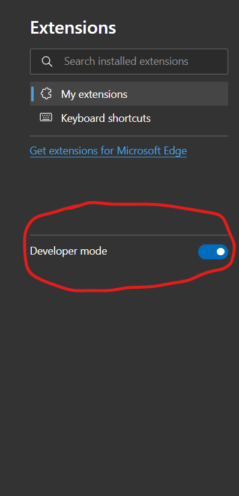
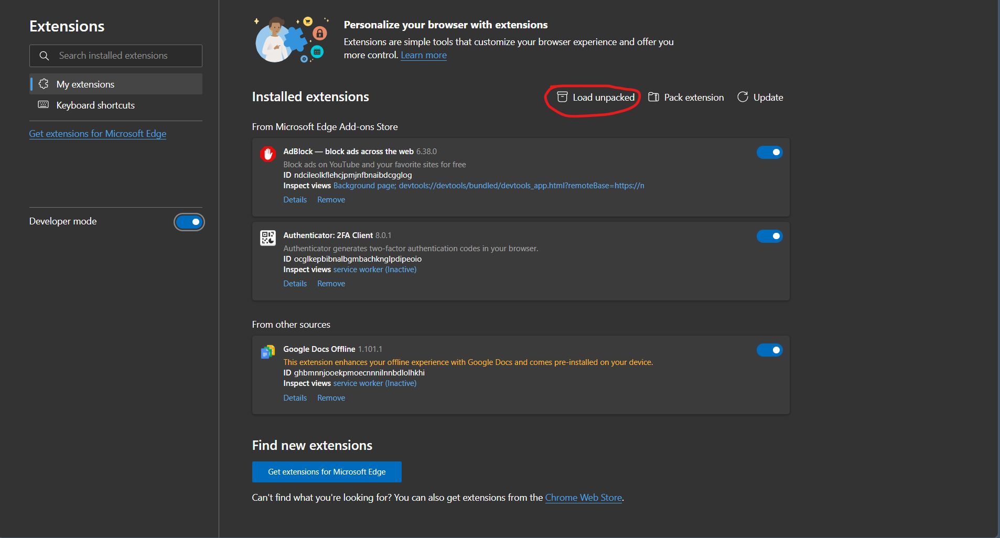

# SpelGuud

SpelGuud is a Chromium extension that compares text inputted in any text fields against its built-in dictionary and the user's custom dictionary. Compared to other spell-checkers, it kinda sucks, but I was making it anyway, so I figured why not.

It works on all Chromium-based browsers, like Chrome (duh), Edge, Opera, etc.

# How to use

As of yet, SpelGuud is not on any web store, so you have to take a few steps to install it. The first step, of course, is to download the .zip and extract it wherever you like. Then, you have to go to your browser's extension page at browser://extensions (i.e., edge://extensions).

Then you have to enable Developer Mode.

  
  
  Next, you need to load an unpacked extension.

  

Now, all Chromium extensions have a manifest.json file in their root that, among other things, tells the browser what permissions it needs. As such, it is **VERY** important that the manifest.json file exists in the root and is correct, or else the browser won't be able to read it and use the extension. <u> The maifest.json file is **NOT** in the project root.</u> It is in the folder labeled "SpelGuud", which is in the root. This folder contains all the extension files, and you can safely delete the other ones in the project without it breaking the extension. An example file path would be C:\Users\me\Downloads\SpelGuud\spelguud.

Once you have selected the right folder, you should be good. You can change settings (currently just removing words from your personal dictionary and changing the color and underline style)

# Testing the extension

For testing this, it's recommended to turn other spellcheckers off. Also, you can switch the error-underlining mode between wavy, straight, and dashed, though wavy can break sometimes. Spellguud also logs debugging messages in the developer F12 console that look like this:

	DEBUG- SPELLRIGHT LOADED

and

	DEBUG- SPELLRIGHT- INPUT DETECTED

Thanks to dwyl for the dictionary. It can be found at https://github.com/dwyl/english-words